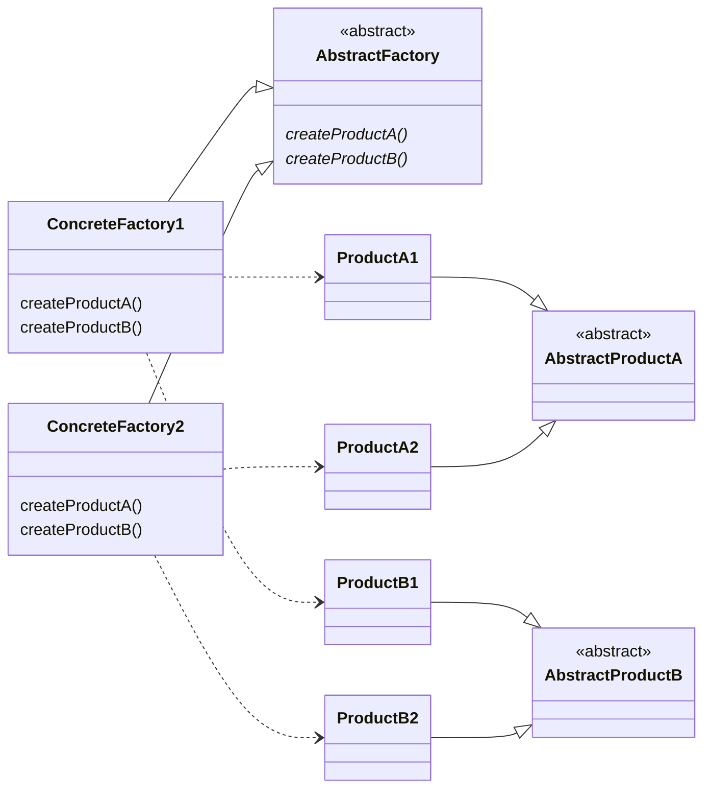

## 目的
特定のクライアント（または状況）に対するオブジェクトのファミリやセットを用意する。
オブジェクトを生成する場所と使う場所を分けることが目的。

Abstract Factoryパターンでは、抽象的な工場が登場し、抽象的部品を組み合わせて抽象的な製品を作る。つまり、部品の具体的な実装には注目せず、インターフェイス（API）に注目する。そして、そのインターフェイス（API）だけを使って、部品を組み立て、製品にまとめる。

## 問題
関連のあるオブジェクトのファミリを実体化する必要がある。

## 解決策
オブジェクトのファミリを生成する。クライアントオブジェクトが使用するオブジェクト群の実体化方法に関する規則を、その使用から切り離す。

## 特徴
このパターンにより、どのオブジェクトを使用するのかという規則と、それらのオブジェクトの使用方法に関するロジックを分離することができる。

## テンプレート
[ソースコード](https://github.com/hirotoshimizu/design-patterns/blob/main/AbstractFactory/abstract-factory.py)

## ダイアグラム
