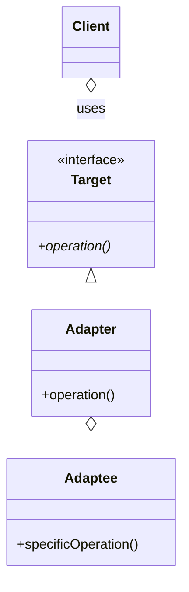

## 目的
修正することの出来ない既存オブジェクトを、特定のインターフェイスに適合させる。

## 問題
使用したいデータや振る舞いが既存システム内に存在しているものの、そのインターフェイスが正しくない場合、通常は、抽象クラスから何らかの派生物を作成しなければならない場合に使用する。

## 解決策
必要なインターフェイスを保持したラッパーを Adapterによって提供する。

## 特徴
Adapterパターンにより、既存オブジェクトをそのインターフェイスに制限されることなく、新たなクラス構造に取り組むことが可能になる。

Adapterパターンには2種類ある。
- クラスによるAdapterパターン（継承を使ったもの）
- インスタンスによるAdapterパターン（委譲を使ったもの）

一般的には、継承を使うよりも委譲を使う方がトラブルが少ない。
それは、スーパークラスの内部的な振る舞いを詳しく知らないと、継承を効果的に使うのが難しいため。

## テンプレート
[ソースコード](https://github.com/hirotoshimizu/design-patterns/blob/main/Adapter/adapter.py)

## ダイアグラム
