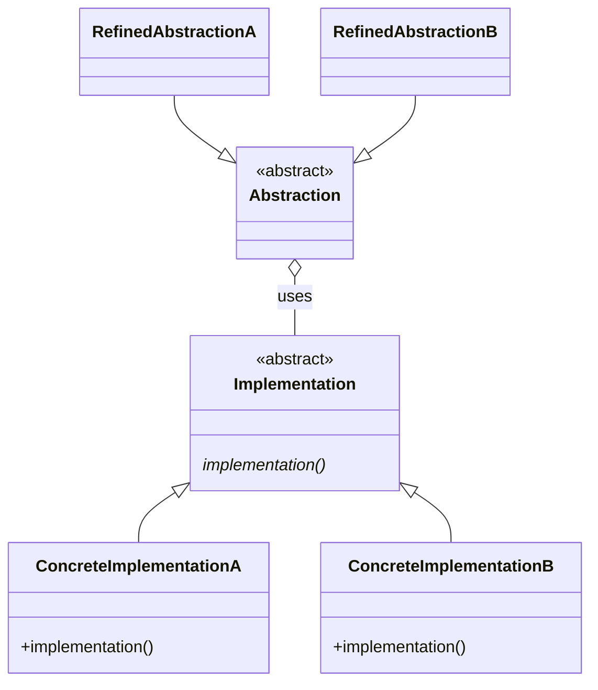

## 目的
現実世界の橋が、2つの場所を結びつけるように、Bridgeパターンも2つの場所を結びつける。
2つの Strategyパターンを結び付けたようなイメージ。
Bridgeパターンが橋渡ししている2つの場所は、
「機能のクラス階層」 と「実装のクラス階層」

実装を使用しているオブジェクト群から、その一連の実装を切り離す。

## 問題
クラス数の爆発を招くことなく、抽象クラスの派生物から複数の実装を使用する必要がある。

## 解決策
使用するすべての実装のインターフェイスを定義し、抽象クラスの派生物からそれらを使用する。

## 特徴
オブジェクトが使用している実装を、そのオブジェクトから切り離すことによって、拡張性を高める。クライアントオブジェクトは、実装に関するあれこれを気にする必要がなくなる。

## テンプレート
[ソースコード](https://github.com/hirotoshimizu/design-patterns/blob/main/Bridge/bridge.py)

## ダイアグラム

