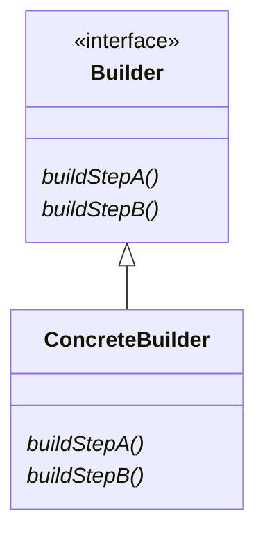

## 目的
クラスの構築に使用できる値がオプショナルの場合、それらのすべてをコンストラクターで指定する必要があると、とても扱いにくい可能性がある。このようなときは、セッター関数を追加してクラスを可変にするよりも、ビルダーパターンを使用するほうが、たいていは適切。

## 問題
多数のパラメーターを持つコンストラクターには、 常にすべてのパラメーターは必要ではない

## 解決策
値を1つずつ設定できるビルダークラスとビルダーが構築した不変の読み取り専用バージョンのクラスを用意する

## 特徴
複雑なオブジェクトの構築方法をカプセル化でき、製品の内部表現をクライアントから隠蔽する。
クライアントには抽象インターフェイスしか見えないため、製品の実装を交換できる。

## テンプレート
[ソースコード](https://github.com/hirotoshimizu/design-patterns/blob/main/Builder/builder.py)

## ダイアグラム
