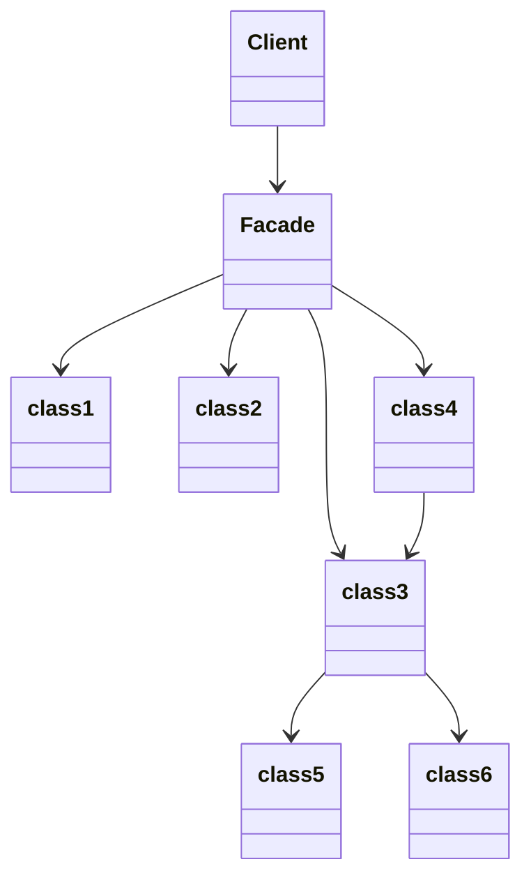

## 目的
既存システムの使用方法を簡素化したい。独自のインターフェイスを定義する必要がある。

## 問題
複雑なシステムの一部だけを使用する必要がある。あるいは、特定の方法でシステムとやり取りを行う必要がある。

## 解決策
Facade によって、既存システムを使用するクライアント向けの新たなインスタンスを提供する。

## 特徴
Facade は要求されたサブシステムの使用方法を簡素化して提供する。しかし、Facadeはすべての機能を提供するためのものではないため、ある種の機能はクライアントから利用できない可能性がある。

||Facade|Adapter|
|:--|:-:|:-:|
|既存クラスがあるか？|はい|いいえ|
|インターフェイスを設計する必要があるか？|いいえ|はい|
|ポリモーフィズムに則ったオブジェクトの振る舞いが必要になるか？|いいえ|おそらくはい|
|より簡潔なインターフェイスが必要か？|はい|いいえ|

## テンプレート
[ソースコード](https://github.com/hirotoshimizu/design-patterns/blob/main/Facade/facade.py)

## ダイアグラム
