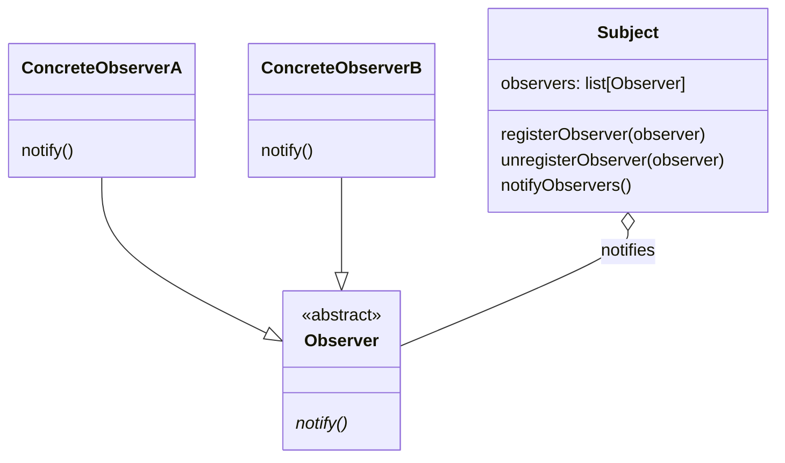

## 目的
オブジェクト間に一対多の依存関係を定義し、あるオブジェクトの状態が変化した際、それに依存するすべてのオブジェクトに対して自動的に通知、更新が行われるようにする。

## 問題
変化する一連のオブジェクトに対して、あるイベントが発生したことを通知する必要がある。

## 解決策
オブザーバーは、観察対象がイベントの監視を一括して行えるよう、その監視義務を委譲する。

## 特徴
オブザーバーがイベントの一部にしか興味を持っていない場合でも、観察対象はオブザーバーに対して通知を行う可能性がある。観察対象がオブザーバーに通知した後、観察対象の持つ何らかの追加情報が必要となった場合、別途やり取りが発生することもある。

## テンプレート
[ソースコード](https://github.com/hirotoshimizu/design-patterns/blob/main/Observer/observer.py)

## ダイアグラム

