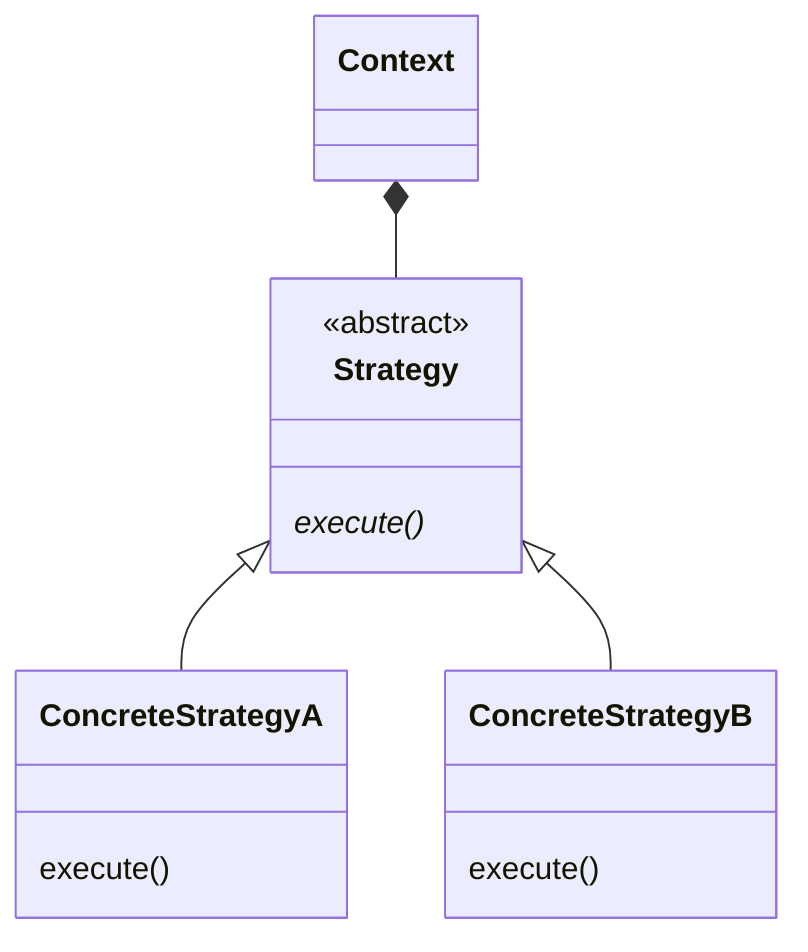

## 目的
さまざまな業務上の規則（ビジネスルール）やアルゴリズムを、それが発生するコンテキストに応じて使い分けられるようにする。

## 問題
要求を行うクライアントや操作対象データによって適用するアルゴリズムを選択する。
規則が変化しない場合、Strategyパターンを使用する必要はない。

## 解決策
該当アルゴリズムの実装からアルゴリズムを個別に切り出す。
これによりコンテキストによる選択が可能になる。

## ダイアグラム
