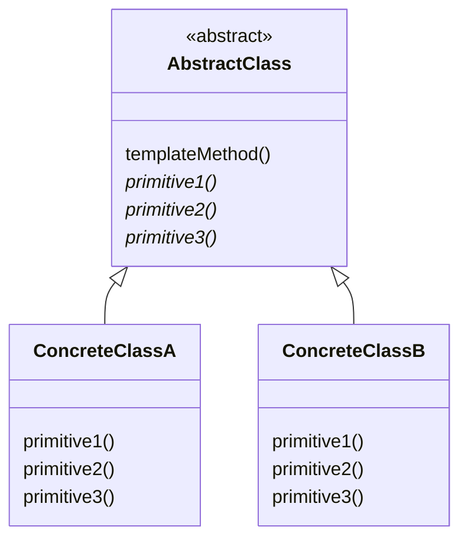

## 目的
ある操作におけるアルゴリズムの骨格を定義し、いくつかの処理の定義についてはサブクラスに任せる。そして、アルゴリズムの構造を変更することなく、その中に含まれる処理の再定義を行う。

## 問題
一定のレベルで整合性のある手続きや一連の手順が存在するものの、個別の処理が詳細レベルで異なった実装になる可能性がある。

## 解決策
整合性のある基本手続きを維持した状態で、変化する処理部分を定義できるようになる。

## 特徴
テンプレートによって、コードを再利用する際のプラットフォームが提供される。また、抽象メソッドを宣言しておくことで、必要となる処理の実装を強制することも可能となる。テンプレートは、各ConcreteClass クラスがオーバーライドした処理をまとめ上げ、これらの流動的要素が常にまとめられた形で実行されるようにする。

## テンプレート
[ソースコード](https://github.com/hirotoshimizu/design-patterns/blob/main/TemplateMethod/template_method.py)

## ダイアグラム

